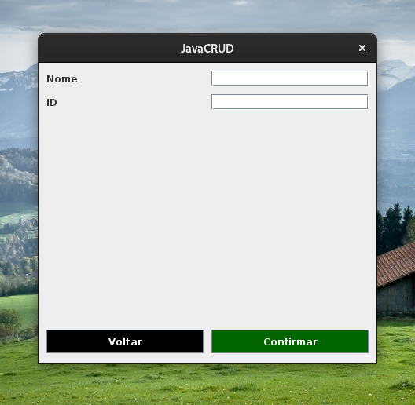

# JavaCRUD

Antes de executar o código dentro de uma IDE (Eclipse é o mais recomendável), é necessário criar a seguinte estrutura dentro do MySQL:

```` 
create database javacrud;

create table clientes(
	id int not null auto_increment,
	nome varchar(255) not null,
	sexo char(1) not null,
	CPF varchar(11) not null unique,
	endereco varchar(255) not null,
	bairro varchar(255) not null,
	municipio varchar(255) not null,
	UF char(2) not null,
	primary key(id)
);
````

##Telas





